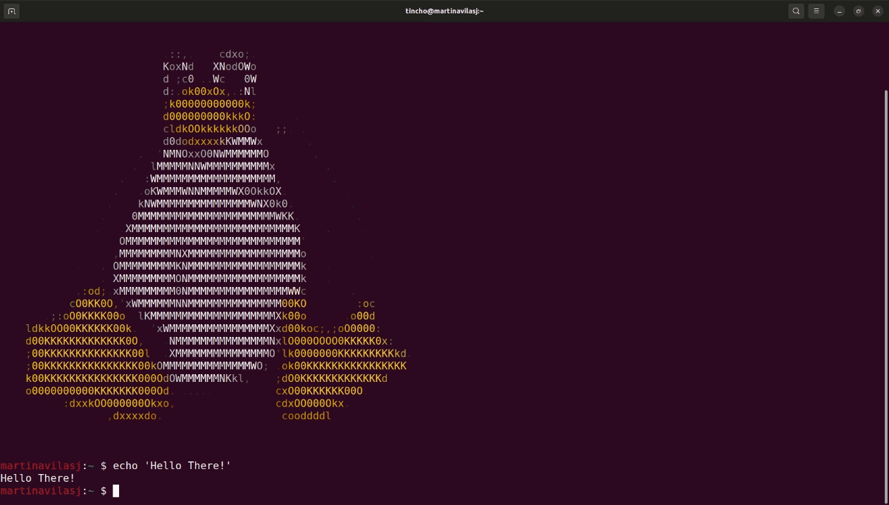

###  **My favorite command is** 
```sudo rm -rf /```   **<- ⚠️ Don't try this at home** ⚠️

### :earth_americas: **I'm from...** 
San Juan, Argentina

<!--### **I speak...** 
### :es:, :us: & :fr:

### **My skills include...**
<p align="left">
 


 </p>

### **I'm learning...**


### Some of my projects 
<!--
**martinavilasj/martinavilasj** is a ✨ _special_ ✨ repository because its `README.md` (this file) appears on your GitHub profile.

Here are some ideas to get you started:

- 🔭 I’m currently working on ...
- 🌱 I’m currently learning ...
- 👯 I’m looking to collaborate on ...
- 🤔 I’m looking for help with ...
- 💬 Ask me about ...
- 📫 How to reach me: ...
- 😄 Pronouns: ...
- ⚡ Fun fact: ...
-->
